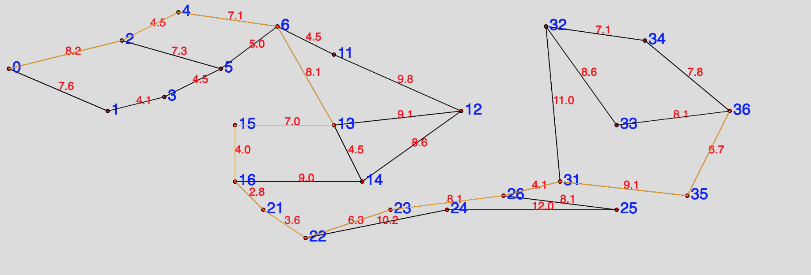
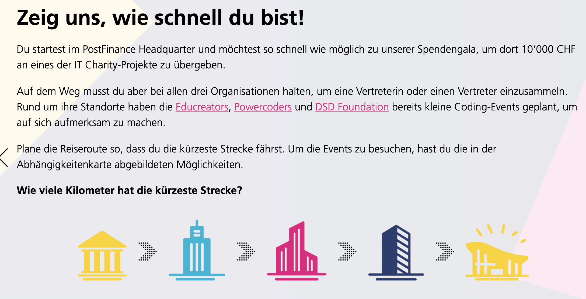
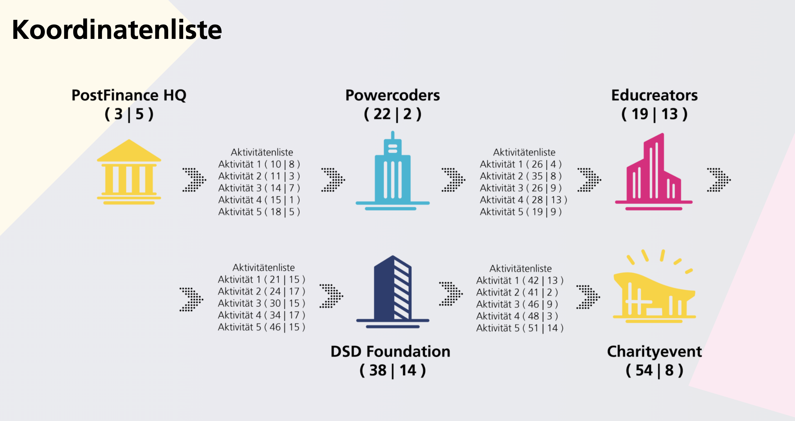
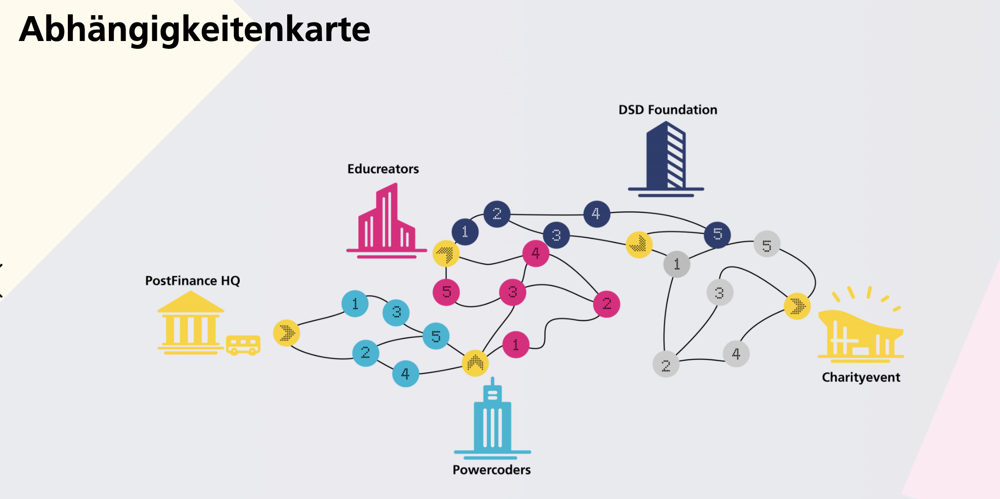
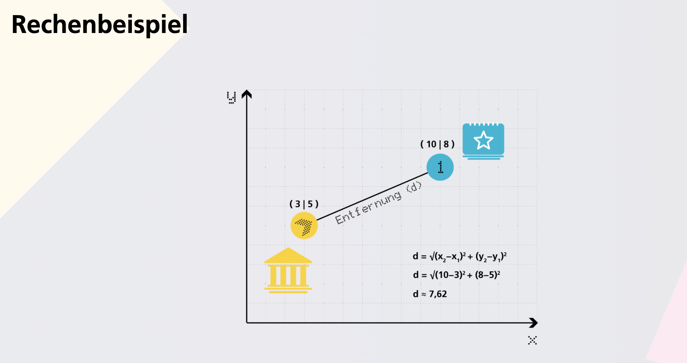

## Requirenments
Challenge was publish at https://itchallengeforfuture.postfinance.ch/, see below for screenshots.

Algorithm to solve the challenge is in sketch.js. Just run sketch.js via NodeJS.

Visualization is done with P5.js, in sketch.js as well. Serve index.html via static webserver (e.g. `python3.8 -m http.server 8002`).

# Postfinance Challenge

