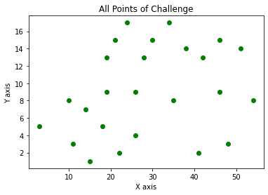
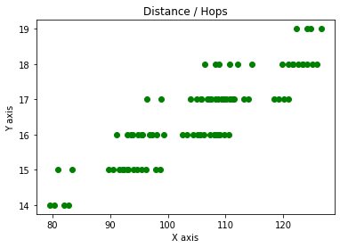

# Postfinance Challenge


## Requirenments

```bash
!pip3 install pandas
!pip3 install numpy
!pip3 install scipy
!pip3 install pprint
!pip3 install matplotlib
```


```python
import pandas as pd
import numpy as np
from dataclasses import make_dataclass
import itertools
from scipy.spatial.distance import squareform, pdist
from pprint import pprint
import matplotlib.pyplot as plt
```

## Data

### Define Points


```python
Point = make_dataclass("Point", [("name", str), ("x", int), ("y", int)])
points = pd.DataFrame([
        Point('s1_PFHQ',  3, 5),
        Point('s1_A1',   10, 8),
        Point('s1_A2',   11, 3),
        Point('s1_A3',   14, 7),
        Point('s1_A4',   15, 1),
        Point('s1_A5',   18, 5),
        
        Point('s2_PC',   22, 2),
        Point('s2_A1',   26, 4),
        Point('s2_A2',   35, 8),
        Point('s2_A3',   26, 9),
        Point('s2_A4',   28, 13),
        Point('s2_A5',   19, 9),
        
        Point('s3_EDU',  19, 13),
        Point('s3_A1',   21, 15),
        Point('s3_A2',   24, 17),
        Point('s3_A3',   30, 15),
        Point('s3_A4',   34, 17),
        Point('s3_A5',   46, 15),

        Point('s4_DSD',  38, 14),
        Point('s4_A1',   42, 13),
        Point('s4_A2',   41,  2),
        Point('s4_A3',   46,  9),
        Point('s4_A4',   48,  3),
        Point('s4_A5',   51, 14),
   
        Point('end',     54,  8)
    ])
#pprint(points)
```

### Distance between Points
Build Matrix to set all point distances in relation


```python
points_distances = pd.DataFrame(squareform(pdist(points.iloc[:, 1:])), columns=points.name.unique(), index=points.name.unique())
pprint(points_distances)
```

               s1_PFHQ      s1_A1      s1_A2      s1_A3      s1_A4      s1_A5  \
    s1_PFHQ   0.000000   7.615773   8.246211  11.180340  12.649111  15.000000   
    s1_A1     7.615773   0.000000   5.099020   4.123106   8.602325   8.544004   
    s1_A2     8.246211   5.099020   0.000000   5.000000   4.472136   7.280110   
    s1_A3    11.180340   4.123106   5.000000   0.000000   6.082763   4.472136   
    s1_A4    12.649111   8.602325   4.472136   6.082763   0.000000   5.000000   
    s1_A5    15.000000   8.544004   7.280110   4.472136   5.000000   0.000000   
    s2_PC    19.235384  13.416408  11.045361   9.433981   7.071068   5.000000   
    s2_A1    23.021729  16.492423  15.033296  12.369317  11.401754   8.062258   
    s2_A2    32.140317  25.000000  24.515301  21.023796  21.189620  17.262677   
    s2_A3    23.345235  16.031220  16.155494  12.165525  13.601471   8.944272   
    s2_A4    26.248809  18.681542  19.723083  15.231546  17.691806  12.806248   
    s2_A5    16.492423   9.055385  10.000000   5.385165   8.944272   4.123106   
    s3_EDU   17.888544  10.295630  12.806248   7.810250  12.649111   8.062258   
    s3_A1    20.591260  13.038405  15.620499  10.630146  15.231546  10.440307   
    s3_A2    24.186773  16.643317  19.104973  14.142136  18.357560  13.416408   
    s3_A3    28.792360  21.189620  22.472205  17.888544  20.518285  15.620499   
    s3_A4    33.241540  25.632011  26.925824  22.360680  24.839485  20.000000   
    s3_A5    44.147480  36.674242  37.000000  32.984845  34.014703  29.732137   
    s4_DSD   36.138622  28.635642  29.154759  25.000000  26.419690  21.931712   
    s4_A1    39.812058  32.388269  32.572995  28.635642  29.546573  25.298221   
    s4_A2    38.118237  31.575307  30.016662  27.459060  26.019224  23.194827   
    s4_A3    43.185646  36.013886  35.510562  32.062439  32.015621  28.284271   
    s4_A4    45.044423  38.327536  37.000000  34.234486  33.060551  30.066593   
    s4_A5    48.836462  41.436699  41.484937  37.656341  38.275318  34.205263   
    end      51.088159  44.000000  43.289722  40.012498  39.623226  36.124784   
    
                 s2_PC      s2_A1      s2_A2      s2_A3  ...      s3_A3  \
    s1_PFHQ  19.235384  23.021729  32.140317  23.345235  ...  28.792360   
    s1_A1    13.416408  16.492423  25.000000  16.031220  ...  21.189620   
    s1_A2    11.045361  15.033296  24.515301  16.155494  ...  22.472205   
    s1_A3     9.433981  12.369317  21.023796  12.165525  ...  17.888544   
    s1_A4     7.071068  11.401754  21.189620  13.601471  ...  20.518285   
    s1_A5     5.000000   8.062258  17.262677   8.944272  ...  15.620499   
    s2_PC     0.000000   4.472136  14.317821   8.062258  ...  15.264338   
    s2_A1     4.472136   0.000000   9.848858   5.000000  ...  11.704700   
    s2_A2    14.317821   9.848858   0.000000   9.055385  ...   8.602325   
    s2_A3     8.062258   5.000000   9.055385   0.000000  ...   7.211103   
    s2_A4    12.529964   9.219544   8.602325   4.472136  ...   2.828427   
    s2_A5     7.615773   8.602325  16.031220   7.000000  ...  12.529964   
    s3_EDU   11.401754  11.401754  16.763055   8.062258  ...  11.180340   
    s3_A1    13.038405  12.083046  15.652476   7.810250  ...   9.000000   
    s3_A2    15.132746  13.152946  14.212670   8.246211  ...   6.324555   
    s3_A3    15.264338  11.704700   8.602325   7.211103  ...   0.000000   
    s3_A4    19.209373  15.264338   9.055385  11.313708  ...   4.472136   
    s3_A5    27.294688  22.825424  13.038405  20.880613  ...  16.000000   
    s4_DSD   20.000000  15.620499   6.708204  13.000000  ...   8.062258   
    s4_A1    22.825424  18.357560   8.602325  16.492423  ...  12.165525   
    s4_A2    19.000000  15.132746   8.485281  16.552945  ...  17.029386   
    s4_A3    25.000000  20.615528  11.045361  20.000000  ...  17.088007   
    s4_A4    26.019224  22.022716  13.928388  22.803509  ...  21.633308   
    s4_A5    31.384710  26.925824  17.088007  25.495098  ...  21.023796   
    end      32.557641  28.284271  19.000000  28.017851  ...  25.000000   
    
                 s3_A4      s3_A5     s4_DSD      s4_A1      s4_A2      s4_A3  \
    s1_PFHQ  33.241540  44.147480  36.138622  39.812058  38.118237  43.185646   
    s1_A1    25.632011  36.674242  28.635642  32.388269  31.575307  36.013886   
    s1_A2    26.925824  37.000000  29.154759  32.572995  30.016662  35.510562   
    s1_A3    22.360680  32.984845  25.000000  28.635642  27.459060  32.062439   
    s1_A4    24.839485  34.014703  26.419690  29.546573  26.019224  32.015621   
    s1_A5    20.000000  29.732137  21.931712  25.298221  23.194827  28.284271   
    s2_PC    19.209373  27.294688  20.000000  22.825424  19.000000  25.000000   
    s2_A1    15.264338  22.825424  15.620499  18.357560  15.132746  20.615528   
    s2_A2     9.055385  13.038405   6.708204   8.602325   8.485281  11.045361   
    s2_A3    11.313708  20.880613  13.000000  16.492423  16.552945  20.000000   
    s2_A4     7.211103  18.110770  10.049876  14.000000  17.029386  18.439089   
    s2_A5    17.000000  27.658633  19.646883  23.345235  23.086793  27.000000   
    s3_EDU   15.524175  27.073973  19.026298  23.000000  24.596748  27.294688   
    s3_A1    13.152946  25.000000  17.029386  21.095023  23.853721  25.709920   
    s3_A2    10.000000  22.090722  14.317821  18.439089  22.671568  23.409400   
    s3_A3     4.472136  16.000000   8.062258  12.165525  17.029386  17.088007   
    s3_A4     0.000000  12.165525   5.000000   8.944272  16.552945  14.422205   
    s3_A5    12.165525   0.000000   8.062258   4.472136  13.928388   6.000000   
    s4_DSD    5.000000   8.062258   0.000000   4.123106  12.369317   9.433981   
    s4_A1     8.944272   4.472136   4.123106   0.000000  11.045361   5.656854   
    s4_A2    16.552945  13.928388  12.369317  11.045361   0.000000   8.602325   
    s4_A3    14.422205   6.000000   9.433981   5.656854   8.602325   0.000000   
    s4_A4    19.798990  12.165525  14.866069  11.661904   7.071068   6.324555   
    s4_A5    17.262677   5.099020  13.000000   9.055385  15.620499   7.071068   
    end      21.931712  10.630146  17.088007  13.000000  14.317821   8.062258   
    
                 s4_A4      s4_A5        end  
    s1_PFHQ  45.044423  48.836462  51.088159  
    s1_A1    38.327536  41.436699  44.000000  
    s1_A2    37.000000  41.484937  43.289722  
    s1_A3    34.234486  37.656341  40.012498  
    s1_A4    33.060551  38.275318  39.623226  
    s1_A5    30.066593  34.205263  36.124784  
    s2_PC    26.019224  31.384710  32.557641  
    s2_A1    22.022716  26.925824  28.284271  
    s2_A2    13.928388  17.088007  19.000000  
    s2_A3    22.803509  25.495098  28.017851  
    s2_A4    22.360680  23.021729  26.476405  
    s2_A5    29.614186  32.388269  35.014283  
    s3_EDU   30.675723  32.015621  35.355339  
    s3_A1    29.546573  30.016662  33.734256  
    s3_A2    27.784888  27.166155  31.320920  
    s3_A3    21.633308  21.023796  25.000000  
    s3_A4    19.798990  17.262677  21.931712  
    s3_A5    12.165525   5.099020  10.630146  
    s4_DSD   14.866069  13.000000  17.088007  
    s4_A1    11.661904   9.055385  13.000000  
    s4_A2     7.071068  15.620499  14.317821  
    s4_A3     6.324555   7.071068   8.062258  
    s4_A4     0.000000  11.401754   7.810250  
    s4_A5    11.401754   0.000000   6.708204  
    end       7.810250   6.708204   0.000000  
    
    [25 rows x 25 columns]


### get distance between two points


```python
# pprint(pg1_distances.loc['s1_PFHQ']['s1_A1'])
```

# define all Waypoints
this defines all possible paths


```python
WayPoint = make_dataclass('WayPoint', [('origin', str), ('target', str)])
wayPoints = pd.DataFrame(
    [
        WayPoint('s1_PFHQ', 's1_A1'),
        WayPoint('s1_PFHQ', 's1_A2'),
        WayPoint('s1_A1', 's1_A3'),
        WayPoint('s1_A2', 's1_A4'),
        WayPoint('s1_A2', 's1_A5'),
        WayPoint('s1_A3', 's1_A5'),
        WayPoint('s1_A4', 's2_PC'),
        WayPoint('s1_A5', 's2_PC'),
        
        WayPoint('s2_PC', 's2_A1'),
        WayPoint('s2_PC', 's2_A3'),
        WayPoint('s2_A1', 's2_A2'),
        WayPoint('s2_A2', 's2_A3'),
        WayPoint('s2_A2', 's2_A4'),
        WayPoint('s2_A3', 's2_A4'),
        WayPoint('s2_A3', 's2_A5'),
        WayPoint('s2_A4', 's3_EDU'),
        WayPoint('s2_A5', 's3_EDU'),
        
        WayPoint('s3_EDU', 's3_A1'),
        WayPoint('s3_A1',  's3_A2'),
        WayPoint('s3_A1',  's3_A2'),
        WayPoint('s3_A2',  's3_A3'),
        WayPoint('s3_A2',  's3_A4'),
        WayPoint('s3_A3',  's4_DSD'),
        WayPoint('s3_A4',  's3_A5'),
        WayPoint('s3_A5',  's4_DSD'),
        
        WayPoint('s4_DSD', 's4_A1'),
        WayPoint('s4_A1', 's4_A2'),
        WayPoint('s4_A1', 's4_A5'),
        WayPoint('s4_A2', 's4_A3'),
        WayPoint('s4_A2', 's4_A4'),
        WayPoint('s4_A3', 'end'),
        WayPoint('s4_A4', 'end'),
        WayPoint('s4_A5', 'end') 
    ])
```

### calculate distance two Waypoints


```python
def distance_race (row):
    return points_distances.loc[row['origin']][row['target']]
    
wayPoints['distance'] =  wayPoints.apply(lambda row: distance_race(row), axis=1)

pprint(wayPoints.head(5))
```

        origin target  distance
    0  s1_PFHQ  s1_A1  7.615773
    1  s1_PFHQ  s1_A2  8.246211
    2    s1_A1  s1_A3  4.123106
    3    s1_A2  s1_A4  4.472136
    4    s1_A2  s1_A5  7.280110


### get all paths // list all possible ways 


```python
def recursive_runner(pos):
    global wayPoints
    childNodes = wayPoints[wayPoints['origin'] == pos].target.to_list() 

    if len(childNodes) == 0:
        return [[pos]]

    paths = []
    for child in childNodes:
        for path in recursive_runner(child):
            paths.append([pos] + path)
    return paths
        
pos = 's1_PFHQ'
paths = recursive_runner(pos)

#pprint(paths)

```

### find the shortest path


```python
Way = make_dataclass('Way', [('fullPath', list), ('hops', int), ('waypoints', list),('distance_waypoints', list), ('distance', float)])
allWays = pd.DataFrame(columns=['fullPath', 'hops', 'waypoints', 'distance_waypoints', 'distance'])

distList = []

for p in paths:
    
    #split path in waystops, start->A1, A1->A3
    path_waypoints = []
    list_cycle = itertools.cycle(p)
    last = next(list_cycle)
    current = ''
    while current != "end":
        current = next(list_cycle)
        path_waypoints.append([last, current])
        last = current
        
    #calculate distance for each section
    distance_sum = 0
    distance_waypoints = []
    for section in path_waypoints:
        add_distance = points_distances.loc[section[0]][section[1]]
        distance_sum = distance_sum + add_distance
        distance_waypoints.append(add_distance)
        
    #merge datasets
    df = pd.DataFrame([Way(p, len(p), path_waypoints, distance_waypoints, distance_sum)] )
    allWays = allWays.append(df)


allWays["fullPathString"] = allWays["fullPath"].str.join("->") 
allWays = allWays.drop_duplicates(subset=['fullPathString'])

allWays = allWays.sort_values(by=['distance'])
shortest = allWays.head(100)

for i, s in shortest.iterrows():
    print('***')
    print("Path: \t\t" + str(s['fullPathString']))
    print("Hops: \t\t" + str(s['hops']))
    print("Distance: \t" + str(s['distance'])+ " km")
    
```

    ***
    Path: 		s1_PFHQ->s1_A2->s1_A4->s2_PC->s2_A3->s2_A5->s3_EDU->s3_A1->s3_A2->s3_A3->s4_DSD->s4_A1->s4_A5->end
    Hops: 		14
    Distance: 	79.55915893149887 km
    ***
    Path: 		s1_PFHQ->s1_A2->s1_A5->s2_PC->s2_A3->s2_A5->s3_EDU->s3_A1->s3_A2->s3_A3->s4_DSD->s4_A1->s4_A5->end
    Hops: 		14
    Distance: 	80.29606505391433 km
    ***
    Path: 		s1_PFHQ->s1_A1->s1_A3->s1_A5->s2_PC->s2_A3->s2_A5->s3_EDU->s3_A1->s3_A2->s3_A3->s4_DSD->s4_A1->s4_A5->end
    Hops: 		15
    Distance: 	80.98075859987964 km
    ***
    Path: 		s1_PFHQ->s1_A2->s1_A4->s2_PC->s2_A3->s2_A4->s3_EDU->s3_A1->s3_A2->s3_A3->s4_DSD->s4_A1->s4_A5->end
    Hops: 		14
    Distance: 	82.03129488649844 km
    ***
    Path: 		s1_PFHQ->s1_A2->s1_A5->s2_PC->s2_A3->s2_A4->s3_EDU->s3_A1->s3_A2->s3_A3->s4_DSD->s4_A1->s4_A5->end
    Hops: 		14
    Distance: 	82.7682010089139 km
    ***
    Path: 		s1_PFHQ->s1_A1->s1_A3->s1_A5->s2_PC->s2_A3->s2_A4->s3_EDU->s3_A1->s3_A2->s3_A3->s4_DSD->s4_A1->s4_A5->end
    Hops: 		15
    Distance: 	83.45289455487921 km
    ***
    Path: 		s1_PFHQ->s1_A2->s1_A4->s2_PC->s2_A3->s2_A5->s3_EDU->s3_A1->s3_A2->s3_A3->s4_DSD->s4_A1->s4_A2->s4_A4->end
    Hops: 		15
    Distance: 	89.72224836582146 km
    ***
    Path: 		s1_PFHQ->s1_A2->s1_A5->s2_PC->s2_A3->s2_A5->s3_EDU->s3_A1->s3_A2->s3_A3->s4_DSD->s4_A1->s4_A2->s4_A4->end
    Hops: 		15
    Distance: 	90.45915448823692 km
    ***
    Path: 		s1_PFHQ->s1_A1->s1_A3->s1_A5->s2_PC->s2_A3->s2_A5->s3_EDU->s3_A1->s3_A2->s3_A3->s4_DSD->s4_A1->s4_A2->s4_A4->end
    Hops: 		16
    Distance: 	91.14384803420222 km
    ***
    Path: 		s1_PFHQ->s1_A2->s1_A4->s2_PC->s2_A3->s2_A5->s3_EDU->s3_A1->s3_A2->s3_A3->s4_DSD->s4_A1->s4_A2->s4_A3->end
    Hops: 		15
    Distance: 	91.50551389339051 km
    ***
    Path: 		s1_PFHQ->s1_A2->s1_A4->s2_PC->s2_A3->s2_A4->s3_EDU->s3_A1->s3_A2->s3_A3->s4_DSD->s4_A1->s4_A2->s4_A4->end
    Hops: 		15
    Distance: 	92.19438432082103 km
    ***
    Path: 		s1_PFHQ->s1_A2->s1_A5->s2_PC->s2_A3->s2_A5->s3_EDU->s3_A1->s3_A2->s3_A3->s4_DSD->s4_A1->s4_A2->s4_A3->end
    Hops: 		15
    Distance: 	92.24242001580598 km
    ***
    Path: 		s1_PFHQ->s1_A2->s1_A4->s2_PC->s2_A1->s2_A2->s2_A4->s3_EDU->s3_A1->s3_A2->s3_A3->s4_DSD->s4_A1->s4_A5->end
    Hops: 		15
    Distance: 	92.42022020703862 km
    ***
    Path: 		s1_PFHQ->s1_A1->s1_A3->s1_A5->s2_PC->s2_A3->s2_A5->s3_EDU->s3_A1->s3_A2->s3_A3->s4_DSD->s4_A1->s4_A2->s4_A3->end
    Hops: 		16
    Distance: 	92.92711356177128 km
    ***
    Path: 		s1_PFHQ->s1_A2->s1_A5->s2_PC->s2_A3->s2_A4->s3_EDU->s3_A1->s3_A2->s3_A3->s4_DSD->s4_A1->s4_A2->s4_A4->end
    Hops: 		15
    Distance: 	92.93129044323649 km
    ***
    Path: 		s1_PFHQ->s1_A2->s1_A5->s2_PC->s2_A1->s2_A2->s2_A4->s3_EDU->s3_A1->s3_A2->s3_A3->s4_DSD->s4_A1->s4_A5->end
    Hops: 		15
    Distance: 	93.15712632945409 km
    ***
    Path: 		s1_PFHQ->s1_A1->s1_A3->s1_A5->s2_PC->s2_A3->s2_A4->s3_EDU->s3_A1->s3_A2->s3_A3->s4_DSD->s4_A1->s4_A2->s4_A4->end
    Hops: 		16
    Distance: 	93.61598398920182 km
    ***
    Path: 		s1_PFHQ->s1_A1->s1_A3->s1_A5->s2_PC->s2_A1->s2_A2->s2_A4->s3_EDU->s3_A1->s3_A2->s3_A3->s4_DSD->s4_A1->s4_A5->end
    Hops: 		16
    Distance: 	93.84181987541939 km
    ***
    Path: 		s1_PFHQ->s1_A2->s1_A4->s2_PC->s2_A3->s2_A4->s3_EDU->s3_A1->s3_A2->s3_A3->s4_DSD->s4_A1->s4_A2->s4_A3->end
    Hops: 		15
    Distance: 	93.97764984839009 km
    ***
    Path: 		s1_PFHQ->s1_A2->s1_A5->s2_PC->s2_A3->s2_A4->s3_EDU->s3_A1->s3_A2->s3_A3->s4_DSD->s4_A1->s4_A2->s4_A3->end
    Hops: 		15
    Distance: 	94.71455597080555 km
    ***
    Path: 		s1_PFHQ->s1_A2->s1_A4->s2_PC->s2_A1->s2_A2->s2_A3->s2_A5->s3_EDU->s3_A1->s3_A2->s3_A3->s4_DSD->s4_A1->s4_A5->end
    Hops: 		16
    Distance: 	94.8732800781334 km
    ***
    Path: 		s1_PFHQ->s1_A1->s1_A3->s1_A5->s2_PC->s2_A3->s2_A4->s3_EDU->s3_A1->s3_A2->s3_A3->s4_DSD->s4_A1->s4_A2->s4_A3->end
    Hops: 		16
    Distance: 	95.39924951677087 km
    ***
    Path: 		s1_PFHQ->s1_A2->s1_A4->s2_PC->s2_A3->s2_A5->s3_EDU->s3_A1->s3_A2->s3_A4->s3_A5->s4_DSD->s4_A1->s4_A5->end
    Hops: 		15
    Distance: 	95.40012867175855 km
    ***
    Path: 		s1_PFHQ->s1_A2->s1_A5->s2_PC->s2_A1->s2_A2->s2_A3->s2_A5->s3_EDU->s3_A1->s3_A2->s3_A3->s4_DSD->s4_A1->s4_A5->end
    Hops: 		16
    Distance: 	95.61018620054887 km
    ***
    Path: 		s1_PFHQ->s1_A2->s1_A5->s2_PC->s2_A3->s2_A5->s3_EDU->s3_A1->s3_A2->s3_A4->s3_A5->s4_DSD->s4_A1->s4_A5->end
    Hops: 		15
    Distance: 	96.13703479417401 km
    ***
    Path: 		s1_PFHQ->s1_A1->s1_A3->s1_A5->s2_PC->s2_A1->s2_A2->s2_A3->s2_A5->s3_EDU->s3_A1->s3_A2->s3_A3->s4_DSD->s4_A1->s4_A5->end
    Hops: 		17
    Distance: 	96.2948797465142 km
    ***
    Path: 		s1_PFHQ->s1_A1->s1_A3->s1_A5->s2_PC->s2_A3->s2_A5->s3_EDU->s3_A1->s3_A2->s3_A4->s3_A5->s4_DSD->s4_A1->s4_A5->end
    Hops: 		16
    Distance: 	96.82172834013932 km
    ***
    Path: 		s1_PFHQ->s1_A2->s1_A4->s2_PC->s2_A1->s2_A2->s2_A3->s2_A4->s3_EDU->s3_A1->s3_A2->s3_A3->s4_DSD->s4_A1->s4_A5->end
    Hops: 		16
    Distance: 	97.34541603313298 km
    ***
    Path: 		s1_PFHQ->s1_A2->s1_A4->s2_PC->s2_A3->s2_A4->s3_EDU->s3_A1->s3_A2->s3_A4->s3_A5->s4_DSD->s4_A1->s4_A5->end
    Hops: 		15
    Distance: 	97.87226462675812 km
    ***
    Path: 		s1_PFHQ->s1_A2->s1_A5->s2_PC->s2_A1->s2_A2->s2_A3->s2_A4->s3_EDU->s3_A1->s3_A2->s3_A3->s4_DSD->s4_A1->s4_A5->end
    Hops: 		16
    Distance: 	98.08232215554844 km
    ***
    Path: 		s1_PFHQ->s1_A2->s1_A5->s2_PC->s2_A3->s2_A4->s3_EDU->s3_A1->s3_A2->s3_A4->s3_A5->s4_DSD->s4_A1->s4_A5->end
    Hops: 		15
    Distance: 	98.60917074917359 km
    ***
    Path: 		s1_PFHQ->s1_A1->s1_A3->s1_A5->s2_PC->s2_A1->s2_A2->s2_A3->s2_A4->s3_EDU->s3_A1->s3_A2->s3_A3->s4_DSD->s4_A1->s4_A5->end
    Hops: 		17
    Distance: 	98.76701570151377 km
    ***
    Path: 		s1_PFHQ->s1_A1->s1_A3->s1_A5->s2_PC->s2_A3->s2_A4->s3_EDU->s3_A1->s3_A2->s3_A4->s3_A5->s4_DSD->s4_A1->s4_A5->end
    Hops: 		16
    Distance: 	99.29386429513889 km
    ***
    Path: 		s1_PFHQ->s1_A2->s1_A4->s2_PC->s2_A1->s2_A2->s2_A4->s3_EDU->s3_A1->s3_A2->s3_A3->s4_DSD->s4_A1->s4_A2->s4_A4->end
    Hops: 		16
    Distance: 	102.58330964136121 km
    ***
    Path: 		s1_PFHQ->s1_A2->s1_A5->s2_PC->s2_A1->s2_A2->s2_A4->s3_EDU->s3_A1->s3_A2->s3_A3->s4_DSD->s4_A1->s4_A2->s4_A4->end
    Hops: 		16
    Distance: 	103.32021576377667 km
    ***
    Path: 		s1_PFHQ->s1_A1->s1_A3->s1_A5->s2_PC->s2_A1->s2_A2->s2_A4->s3_EDU->s3_A1->s3_A2->s3_A3->s4_DSD->s4_A1->s4_A2->s4_A4->end
    Hops: 		17
    Distance: 	104.004909309742 km
    ***
    Path: 		s1_PFHQ->s1_A2->s1_A4->s2_PC->s2_A1->s2_A2->s2_A4->s3_EDU->s3_A1->s3_A2->s3_A3->s4_DSD->s4_A1->s4_A2->s4_A3->end
    Hops: 		16
    Distance: 	104.36657516893027 km
    ***
    Path: 		s1_PFHQ->s1_A2->s1_A4->s2_PC->s2_A1->s2_A2->s2_A3->s2_A5->s3_EDU->s3_A1->s3_A2->s3_A3->s4_DSD->s4_A1->s4_A2->s4_A4->end
    Hops: 		17
    Distance: 	105.03636951245602 km
    ***
    Path: 		s1_PFHQ->s1_A2->s1_A5->s2_PC->s2_A1->s2_A2->s2_A4->s3_EDU->s3_A1->s3_A2->s3_A3->s4_DSD->s4_A1->s4_A2->s4_A3->end
    Hops: 		16
    Distance: 	105.10348129134573 km
    ***
    Path: 		s1_PFHQ->s1_A2->s1_A4->s2_PC->s2_A3->s2_A5->s3_EDU->s3_A1->s3_A2->s3_A4->s3_A5->s4_DSD->s4_A1->s4_A2->s4_A4->end
    Hops: 		16
    Distance: 	105.56321810608114 km
    ***
    Path: 		s1_PFHQ->s1_A2->s1_A5->s2_PC->s2_A1->s2_A2->s2_A3->s2_A5->s3_EDU->s3_A1->s3_A2->s3_A3->s4_DSD->s4_A1->s4_A2->s4_A4->end
    Hops: 		17
    Distance: 	105.77327563487148 km
    ***
    Path: 		s1_PFHQ->s1_A1->s1_A3->s1_A5->s2_PC->s2_A1->s2_A2->s2_A4->s3_EDU->s3_A1->s3_A2->s3_A3->s4_DSD->s4_A1->s4_A2->s4_A3->end
    Hops: 		17
    Distance: 	105.78817483731105 km
    ***
    Path: 		s1_PFHQ->s1_A2->s1_A5->s2_PC->s2_A3->s2_A5->s3_EDU->s3_A1->s3_A2->s3_A4->s3_A5->s4_DSD->s4_A1->s4_A2->s4_A4->end
    Hops: 		16
    Distance: 	106.3001242284966 km
    ***
    Path: 		s1_PFHQ->s1_A1->s1_A3->s1_A5->s2_PC->s2_A1->s2_A2->s2_A3->s2_A5->s3_EDU->s3_A1->s3_A2->s3_A3->s4_DSD->s4_A1->s4_A2->s4_A4->end
    Hops: 		18
    Distance: 	106.45796918083678 km
    ***
    Path: 		s1_PFHQ->s1_A2->s1_A4->s2_PC->s2_A1->s2_A2->s2_A3->s2_A5->s3_EDU->s3_A1->s3_A2->s3_A3->s4_DSD->s4_A1->s4_A2->s4_A3->end
    Hops: 		17
    Distance: 	106.81963504002506 km
    ***
    Path: 		s1_PFHQ->s1_A1->s1_A3->s1_A5->s2_PC->s2_A3->s2_A5->s3_EDU->s3_A1->s3_A2->s3_A4->s3_A5->s4_DSD->s4_A1->s4_A2->s4_A4->end
    Hops: 		17
    Distance: 	106.9848177744619 km
    ***
    Path: 		s1_PFHQ->s1_A2->s1_A4->s2_PC->s2_A3->s2_A5->s3_EDU->s3_A1->s3_A2->s3_A4->s3_A5->s4_DSD->s4_A1->s4_A2->s4_A3->end
    Hops: 		16
    Distance: 	107.3464836336502 km
    ***
    Path: 		s1_PFHQ->s1_A2->s1_A4->s2_PC->s2_A1->s2_A2->s2_A3->s2_A4->s3_EDU->s3_A1->s3_A2->s3_A3->s4_DSD->s4_A1->s4_A2->s4_A4->end
    Hops: 		17
    Distance: 	107.50850546745559 km
    ***
    Path: 		s1_PFHQ->s1_A2->s1_A5->s2_PC->s2_A1->s2_A2->s2_A3->s2_A5->s3_EDU->s3_A1->s3_A2->s3_A3->s4_DSD->s4_A1->s4_A2->s4_A3->end
    Hops: 		17
    Distance: 	107.55654116244052 km
    ***
    Path: 		s1_PFHQ->s1_A2->s1_A4->s2_PC->s2_A3->s2_A4->s3_EDU->s3_A1->s3_A2->s3_A4->s3_A5->s4_DSD->s4_A1->s4_A2->s4_A4->end
    Hops: 		16
    Distance: 	108.03535406108071 km
    ***
    Path: 		s1_PFHQ->s1_A2->s1_A5->s2_PC->s2_A3->s2_A5->s3_EDU->s3_A1->s3_A2->s3_A4->s3_A5->s4_DSD->s4_A1->s4_A2->s4_A3->end
    Hops: 		16
    Distance: 	108.08338975606566 km
    ***
    Path: 		s1_PFHQ->s1_A1->s1_A3->s1_A5->s2_PC->s2_A1->s2_A2->s2_A3->s2_A5->s3_EDU->s3_A1->s3_A2->s3_A3->s4_DSD->s4_A1->s4_A2->s4_A3->end
    Hops: 		18
    Distance: 	108.24123470840584 km
    ***
    Path: 		s1_PFHQ->s1_A2->s1_A5->s2_PC->s2_A1->s2_A2->s2_A3->s2_A4->s3_EDU->s3_A1->s3_A2->s3_A3->s4_DSD->s4_A1->s4_A2->s4_A4->end
    Hops: 		17
    Distance: 	108.24541158987105 km
    ***
    Path: 		s1_PFHQ->s1_A2->s1_A4->s2_PC->s2_A1->s2_A2->s2_A4->s3_EDU->s3_A1->s3_A2->s3_A4->s3_A5->s4_DSD->s4_A1->s4_A5->end
    Hops: 		16
    Distance: 	108.2611899472983 km
    ***
    Path: 		s1_PFHQ->s1_A1->s1_A3->s1_A5->s2_PC->s2_A3->s2_A5->s3_EDU->s3_A1->s3_A2->s3_A4->s3_A5->s4_DSD->s4_A1->s4_A2->s4_A3->end
    Hops: 		17
    Distance: 	108.76808330203096 km
    ***
    Path: 		s1_PFHQ->s1_A2->s1_A5->s2_PC->s2_A3->s2_A4->s3_EDU->s3_A1->s3_A2->s3_A4->s3_A5->s4_DSD->s4_A1->s4_A2->s4_A4->end
    Hops: 		16
    Distance: 	108.77226018349617 km
    ***
    Path: 		s1_PFHQ->s1_A1->s1_A3->s1_A5->s2_PC->s2_A1->s2_A2->s2_A3->s2_A4->s3_EDU->s3_A1->s3_A2->s3_A3->s4_DSD->s4_A1->s4_A2->s4_A4->end
    Hops: 		18
    Distance: 	108.93010513583636 km
    ***
    Path: 		s1_PFHQ->s1_A2->s1_A5->s2_PC->s2_A1->s2_A2->s2_A4->s3_EDU->s3_A1->s3_A2->s3_A4->s3_A5->s4_DSD->s4_A1->s4_A5->end
    Hops: 		16
    Distance: 	108.99809606971377 km
    ***
    Path: 		s1_PFHQ->s1_A2->s1_A4->s2_PC->s2_A1->s2_A2->s2_A3->s2_A4->s3_EDU->s3_A1->s3_A2->s3_A3->s4_DSD->s4_A1->s4_A2->s4_A3->end
    Hops: 		17
    Distance: 	109.29177099502463 km
    ***
    Path: 		s1_PFHQ->s1_A1->s1_A3->s1_A5->s2_PC->s2_A3->s2_A4->s3_EDU->s3_A1->s3_A2->s3_A4->s3_A5->s4_DSD->s4_A1->s4_A2->s4_A4->end
    Hops: 		17
    Distance: 	109.4569537294615 km
    ***
    Path: 		s1_PFHQ->s1_A1->s1_A3->s1_A5->s2_PC->s2_A1->s2_A2->s2_A4->s3_EDU->s3_A1->s3_A2->s3_A4->s3_A5->s4_DSD->s4_A1->s4_A5->end
    Hops: 		17
    Distance: 	109.68278961567907 km
    ***
    Path: 		s1_PFHQ->s1_A2->s1_A4->s2_PC->s2_A3->s2_A4->s3_EDU->s3_A1->s3_A2->s3_A4->s3_A5->s4_DSD->s4_A1->s4_A2->s4_A3->end
    Hops: 		16
    Distance: 	109.81861958864977 km
    ***
    Path: 		s1_PFHQ->s1_A2->s1_A5->s2_PC->s2_A1->s2_A2->s2_A3->s2_A4->s3_EDU->s3_A1->s3_A2->s3_A3->s4_DSD->s4_A1->s4_A2->s4_A3->end
    Hops: 		17
    Distance: 	110.0286771174401 km
    ***
    Path: 		s1_PFHQ->s1_A2->s1_A5->s2_PC->s2_A3->s2_A4->s3_EDU->s3_A1->s3_A2->s3_A4->s3_A5->s4_DSD->s4_A1->s4_A2->s4_A3->end
    Hops: 		16
    Distance: 	110.55552571106523 km
    ***
    Path: 		s1_PFHQ->s1_A1->s1_A3->s1_A5->s2_PC->s2_A1->s2_A2->s2_A3->s2_A4->s3_EDU->s3_A1->s3_A2->s3_A3->s4_DSD->s4_A1->s4_A2->s4_A3->end
    Hops: 		18
    Distance: 	110.71337066340541 km
    ***
    Path: 		s1_PFHQ->s1_A2->s1_A4->s2_PC->s2_A1->s2_A2->s2_A3->s2_A5->s3_EDU->s3_A1->s3_A2->s3_A4->s3_A5->s4_DSD->s4_A1->s4_A5->end
    Hops: 		17
    Distance: 	110.71424981839309 km
    ***
    Path: 		s1_PFHQ->s1_A1->s1_A3->s1_A5->s2_PC->s2_A3->s2_A4->s3_EDU->s3_A1->s3_A2->s3_A4->s3_A5->s4_DSD->s4_A1->s4_A2->s4_A3->end
    Hops: 		17
    Distance: 	111.24021925703055 km
    ***
    Path: 		s1_PFHQ->s1_A2->s1_A5->s2_PC->s2_A1->s2_A2->s2_A3->s2_A5->s3_EDU->s3_A1->s3_A2->s3_A4->s3_A5->s4_DSD->s4_A1->s4_A5->end
    Hops: 		17
    Distance: 	111.45115594080855 km
    ***
    Path: 		s1_PFHQ->s1_A1->s1_A3->s1_A5->s2_PC->s2_A1->s2_A2->s2_A3->s2_A5->s3_EDU->s3_A1->s3_A2->s3_A4->s3_A5->s4_DSD->s4_A1->s4_A5->end
    Hops: 		18
    Distance: 	112.13584948677388 km
    ***
    Path: 		s1_PFHQ->s1_A2->s1_A4->s2_PC->s2_A1->s2_A2->s2_A3->s2_A4->s3_EDU->s3_A1->s3_A2->s3_A4->s3_A5->s4_DSD->s4_A1->s4_A5->end
    Hops: 		17
    Distance: 	113.18638577339266 km
    ***
    Path: 		s1_PFHQ->s1_A2->s1_A5->s2_PC->s2_A1->s2_A2->s2_A3->s2_A4->s3_EDU->s3_A1->s3_A2->s3_A4->s3_A5->s4_DSD->s4_A1->s4_A5->end
    Hops: 		17
    Distance: 	113.92329189580812 km
    ***
    Path: 		s1_PFHQ->s1_A1->s1_A3->s1_A5->s2_PC->s2_A1->s2_A2->s2_A3->s2_A4->s3_EDU->s3_A1->s3_A2->s3_A4->s3_A5->s4_DSD->s4_A1->s4_A5->end
    Hops: 		18
    Distance: 	114.60798544177345 km
    ***
    Path: 		s1_PFHQ->s1_A2->s1_A4->s2_PC->s2_A1->s2_A2->s2_A4->s3_EDU->s3_A1->s3_A2->s3_A4->s3_A5->s4_DSD->s4_A1->s4_A2->s4_A4->end
    Hops: 		17
    Distance: 	118.42427938162089 km
    ***
    Path: 		s1_PFHQ->s1_A2->s1_A5->s2_PC->s2_A1->s2_A2->s2_A4->s3_EDU->s3_A1->s3_A2->s3_A4->s3_A5->s4_DSD->s4_A1->s4_A2->s4_A4->end
    Hops: 		17
    Distance: 	119.16118550403635 km
    ***
    Path: 		s1_PFHQ->s1_A1->s1_A3->s1_A5->s2_PC->s2_A1->s2_A2->s2_A4->s3_EDU->s3_A1->s3_A2->s3_A4->s3_A5->s4_DSD->s4_A1->s4_A2->s4_A4->end
    Hops: 		18
    Distance: 	119.84587905000168 km
    ***
    Path: 		s1_PFHQ->s1_A2->s1_A4->s2_PC->s2_A1->s2_A2->s2_A4->s3_EDU->s3_A1->s3_A2->s3_A4->s3_A5->s4_DSD->s4_A1->s4_A2->s4_A3->end
    Hops: 		17
    Distance: 	120.20754490918995 km
    ***
    Path: 		s1_PFHQ->s1_A2->s1_A4->s2_PC->s2_A1->s2_A2->s2_A3->s2_A5->s3_EDU->s3_A1->s3_A2->s3_A4->s3_A5->s4_DSD->s4_A1->s4_A2->s4_A4->end
    Hops: 		18
    Distance: 	120.87733925271567 km
    ***
    Path: 		s1_PFHQ->s1_A2->s1_A5->s2_PC->s2_A1->s2_A2->s2_A4->s3_EDU->s3_A1->s3_A2->s3_A4->s3_A5->s4_DSD->s4_A1->s4_A2->s4_A3->end
    Hops: 		17
    Distance: 	120.94445103160541 km
    ***
    Path: 		s1_PFHQ->s1_A2->s1_A5->s2_PC->s2_A1->s2_A2->s2_A3->s2_A5->s3_EDU->s3_A1->s3_A2->s3_A4->s3_A5->s4_DSD->s4_A1->s4_A2->s4_A4->end
    Hops: 		18
    Distance: 	121.61424537513113 km
    ***
    Path: 		s1_PFHQ->s1_A1->s1_A3->s1_A5->s2_PC->s2_A1->s2_A2->s2_A4->s3_EDU->s3_A1->s3_A2->s3_A4->s3_A5->s4_DSD->s4_A1->s4_A2->s4_A3->end
    Hops: 		18
    Distance: 	121.62914457757073 km
    ***
    Path: 		s1_PFHQ->s1_A1->s1_A3->s1_A5->s2_PC->s2_A1->s2_A2->s2_A3->s2_A5->s3_EDU->s3_A1->s3_A2->s3_A4->s3_A5->s4_DSD->s4_A1->s4_A2->s4_A4->end
    Hops: 		19
    Distance: 	122.29893892109646 km
    ***
    Path: 		s1_PFHQ->s1_A2->s1_A4->s2_PC->s2_A1->s2_A2->s2_A3->s2_A5->s3_EDU->s3_A1->s3_A2->s3_A4->s3_A5->s4_DSD->s4_A1->s4_A2->s4_A3->end
    Hops: 		18
    Distance: 	122.66060478028473 km
    ***
    Path: 		s1_PFHQ->s1_A2->s1_A4->s2_PC->s2_A1->s2_A2->s2_A3->s2_A4->s3_EDU->s3_A1->s3_A2->s3_A4->s3_A5->s4_DSD->s4_A1->s4_A2->s4_A4->end
    Hops: 		18
    Distance: 	123.34947520771527 km
    ***
    Path: 		s1_PFHQ->s1_A2->s1_A5->s2_PC->s2_A1->s2_A2->s2_A3->s2_A5->s3_EDU->s3_A1->s3_A2->s3_A4->s3_A5->s4_DSD->s4_A1->s4_A2->s4_A3->end
    Hops: 		18
    Distance: 	123.39751090270019 km
    ***
    Path: 		s1_PFHQ->s1_A1->s1_A3->s1_A5->s2_PC->s2_A1->s2_A2->s2_A3->s2_A5->s3_EDU->s3_A1->s3_A2->s3_A4->s3_A5->s4_DSD->s4_A1->s4_A2->s4_A3->end
    Hops: 		19
    Distance: 	124.08220444866552 km
    ***
    Path: 		s1_PFHQ->s1_A2->s1_A5->s2_PC->s2_A1->s2_A2->s2_A3->s2_A4->s3_EDU->s3_A1->s3_A2->s3_A4->s3_A5->s4_DSD->s4_A1->s4_A2->s4_A4->end
    Hops: 		18
    Distance: 	124.08638133013073 km
    ***
    Path: 		s1_PFHQ->s1_A1->s1_A3->s1_A5->s2_PC->s2_A1->s2_A2->s2_A3->s2_A4->s3_EDU->s3_A1->s3_A2->s3_A4->s3_A5->s4_DSD->s4_A1->s4_A2->s4_A4->end
    Hops: 		19
    Distance: 	124.77107487609604 km
    ***
    Path: 		s1_PFHQ->s1_A2->s1_A4->s2_PC->s2_A1->s2_A2->s2_A3->s2_A4->s3_EDU->s3_A1->s3_A2->s3_A4->s3_A5->s4_DSD->s4_A1->s4_A2->s4_A3->end
    Hops: 		18
    Distance: 	125.13274073528432 km
    ***
    Path: 		s1_PFHQ->s1_A2->s1_A5->s2_PC->s2_A1->s2_A2->s2_A3->s2_A4->s3_EDU->s3_A1->s3_A2->s3_A4->s3_A5->s4_DSD->s4_A1->s4_A2->s4_A3->end
    Hops: 		18
    Distance: 	125.86964685769978 km
    ***
    Path: 		s1_PFHQ->s1_A1->s1_A3->s1_A5->s2_PC->s2_A1->s2_A2->s2_A3->s2_A4->s3_EDU->s3_A1->s3_A2->s3_A4->s3_A5->s4_DSD->s4_A1->s4_A2->s4_A3->end
    Hops: 		19
    Distance: 	126.5543404036651 km


## Visualisation

### Points


```python

x = points['x']
y = points['y']
plt.title("All Points of Challenge")
plt.xlabel("X axis")
plt.ylabel("Y axis")
plt.plot(x, y, 'o',color='green');
```


    

    


```python
### distribution distance / hops
```


```python
x = allWays['distance']
y = allWays['hops']
plt.title("Distance / Hops")
plt.xlabel("X axis")
plt.ylabel("Y axis")
plt.plot(x, y, 'o',color='green');
```


    

